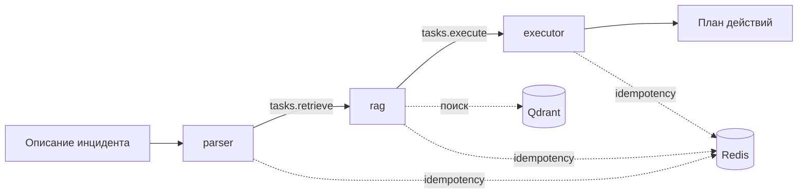
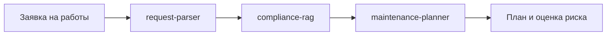

# AgentMesh

Этот проект я собрал в рамках тестового задания для Сбера. Задача была не просто
сделать цепочку из нескольких агентов, а подготовить небольшую платформу, на
которой можно собирать разные мультиагентные сценарии без изменений в ядре.

В итоге получился рабочий PoC на Python: агенты живут в отдельных контейнерах,
общаются через NATS JetStream и подключаются через YAML-конфигурацию. В комплекте
есть два примера — разбор инцидента PostgreSQL и подготовка плана регламентных
работ.

## Что здесь есть

- единый формат сообщений между агентами;
- независимые сервисы с общим SDK и универсальным runner;
- конфигурация состава и связей через YAML и env;
- NATS JetStream для асинхронного обмена;
- Redis для идемпотентности и Qdrant для RAG;
- сквозные трейсы в Jaeger и структурированные JSON-логи;
- retry, backoff, DLQ, healthcheck и restart policy;
- локальный запуск одной командой;
- mock-режим без внешнего LLM API.

## Основной сценарий

В демо приходит описание инцидента PostgreSQL, после чего оно проходит через
три агента:



- `parser` приводит входные данные к нормализованной структуре;
- `rag` находит подходящие инструкции в базе runbook-ов;
- `executor` формирует итоговый план действий.

`executor` работает только в `dry-run`: он показывает, что собирается сделать,
но не выполняет SQL и не меняет инфраструктуру.

## Быстрый запуск

Понадобятся Docker с Compose и `make`.

```bash
make first-run
```

Команда соберёт общий образ, поднимет инфраструктуру и агентов, отправит тестовый
инцидент и дождётся финального события от `executor`.

Трейс всей цепочки можно посмотреть в Jaeger:
[http://localhost:16686](http://localhost:16686).

Остановить проект и удалить созданные volumes:

```bash
make down
```

При первой сборке нужен интернет для загрузки Docker-образов и Python-пакетов.
Само демо по умолчанию использует mock-провайдер и после сборки не требует API
внешней модели.

## Полезные команды

```bash
make first-run             # собрать проект и запустить основное демо
make demo                  # повторно прогнать parser -> rag -> executor
make demo-alt              # добавить summarizer и изменить цепочку через YAML
make chaos                 # перезапустить агента во время обработки сообщения
make demo-request          # сценарий регламентных работ
make demo-request-invalid  # невалидная заявка, retries и DLQ
make test                  # unit-тесты без Docker
make logs                  # логи всех сервисов
make down                  # остановить проект
```

## Как устроена платформа

Я сознательно не добавлял центральный оркестратор, который знает весь сценарий.
Каждый агент подписан на свой subject, обрабатывает сообщение и публикует
результат дальше. Состав системы и маршруты задаются конфигурацией.

В ядре четыре основные части:

- `Envelope` — единый Pydantic-контракт сообщения;
- `BaseAgent` — жизненный цикл, tracing, ack/nak, retry и idempotency;
- `JetStreamBus` — работа с NATS JetStream;
- `runner` — загрузка нужного класса агента из YAML и его запуск.

Сообщение содержит `message_id`, `correlation_id`, отправителя, subject, тип,
trace context, TTL и произвольный JSON payload. Ядро не знает схему payload:
её проверяет сам агент своей Pydantic-моделью.

Доставка — `at-least-once`. Повторная обработка одного сообщения для одного
consumer-а блокируется через Redis.

## Конфигурация агентов

Основной пайплайн описан в
[`configs/incident_triage.yaml`](configs/incident_triage.yaml):

```yaml
system: incident-triage

llm:
  provider: ${LLM_PROVIDER:-mock}
  model: deepseek-chat

agents:
  - name: parser
    module: agents.parser:ParserAgent
    subscribes: tasks.parse
    publishes: [tasks.retrieve]
    stores: [redis]

  - name: rag
    module: agents.rag:RagAgent
    subscribes: tasks.retrieve
    publishes: [tasks.execute]
    stores: [redis, qdrant]
    params:
      collection: runbooks
      top_k: 3

  - name: executor
    module: agents.executor:ExecutorAgent
    subscribes: tasks.execute
    publishes: [events.incident.completed]
    stores: [redis]
    params:
      dry_run: true
```

Здесь задаются класс агента, входной subject, выходные subject-ы, нужные
хранилища и произвольные параметры. Значения можно подставлять из env.

Например, конфигурация
[`configs/triage_with_summary.yaml`](configs/triage_with_summary.yaml) добавляет
`summarizer` после `executor`. Код существующих агентов и ядро при этом не
меняются:

```bash
make demo-alt
```

## Как добавить своего агента

Новый агент наследуется от `BaseAgent` и реализует метод `handle`:

```python
from platform_core.agent import BaseAgent
from platform_core.envelope import Envelope


class NotifierAgent(BaseAgent):
    async def handle(self, env: Envelope) -> None:
        incident = env.payload["incident"]
        # Здесь может быть отправка уведомления или вызов внешнего API.
        print(f"Incident resolved: {incident['host']}")
```

После этого достаточно:

1. добавить класс в проект;
2. зарегистрировать его в YAML через
   `module: agents.notifier:NotifierAgent`;
3. добавить сервис в `docker-compose.yml` с нужным `AGENT_NAME`.

Настраивать NATS-клиент, tracing, ack/nak, retry и Redis в каждом агенте заново
не нужно — это делает `BaseAgent`.

## Отказоустойчивость

У каждого агента свой контейнер и healthcheck. Если процесс падает, Docker
перезапускает только этот сервис. Незавершённое сообщение остаётся в JetStream
и после восстановления обрабатывается повторно.

Ошибки обработчика получают задержки `2 / 4 / 8 / 16` секунд. После пятой
неудачной доставки сообщение публикуется в `dlq.<role>` и подтверждается в
исходном consumer-е.

Это можно проверить не только по коду:

```bash
make chaos
```

Скрипт отправляет сообщение, завершает `executor` во время обработки, ждёт его
перезапуска и проверяет, что цепочка всё равно дошла до финального события.

## Наблюдаемость

`correlation_id` и W3C `traceparent` передаются через всю цепочку. Каждый агент
создаёт span обработки, а публикация следующего сообщения становится дочерним
span. Трейсы уходят по OTLP в Jaeger.

Логи пишутся в JSON и содержат имя агента, subject, `message_id`,
`correlation_id`, `trace_id` и номер попытки. Это позволяет связать логи
нескольких контейнеров с одним сценарием.

## Второй пример

Чтобы проверить, что платформа не привязана к разбору инцидентов, я добавил
отдельный сценарий регламентных работ:



```bash
make demo-request
```

Сценарий принимает заявку на обновление ОС, находит подходящие compliance-правила
и собирает план с оценкой риска. Невалидную заявку можно отправить командой
`make demo-request-invalid`: она пройдёт настроенные повторы и попадёт в DLQ.

## Подключение реальной LLM

По умолчанию включён детерминированный mock, чтобы проверяющий мог запустить
проект без ключей. Для DeepSeek:

```bash
cp .env.example .env
```

В `.env` нужно указать:

```dotenv
LLM_PROVIDER=deepseek
DEEPSEEK_API_KEY=...
```

После этого можно снова выполнить `make demo`. Провайдер выбирается конфигурацией,
а агенты работают через общий LLM-интерфейс.

## Структура репозитория

```text
platform_core/   ядро платформы и SDK
agents/          агенты двух демонстрационных сценариев
configs/         YAML-конфигурации систем
data/            runbook-и и compliance-документы для RAG
scripts/         инжекторы, ожидание событий, DLQ и chaos demo
tests/           unit- и интеграционные тесты
docker-compose.yml
```

Архитектурные решения и их компромиссы отдельно описаны в
[`docs/adr.md`](docs/adr.md).

## Ограничения PoC

Это локальный демонстрационный стенд, а не production-кластер:

- NATS и Redis запущены в одном экземпляре;
- для инфраструктурных сервисов не настроены TLS и авторизация;
- persistence рассчитан на локальное демо;
- один агент подписывается на один точный subject;
- `executor` ничего не применяет к реальной БД.

Для production-варианта следующим шагом были бы кластеризация инфраструктуры,
секреты, ACL, метрики и алерты, schema registry и отдельный deployment-контур
для агентов.

## Проверка

```bash
make test
```

В CI запускаются unit-тесты, lint, dependency audit и проверка
Docker Compose-конфигурации. Runtime e2e и chaos-проверки оставлены отдельными
командами, потому что они поднимают полный Docker-стенд.
