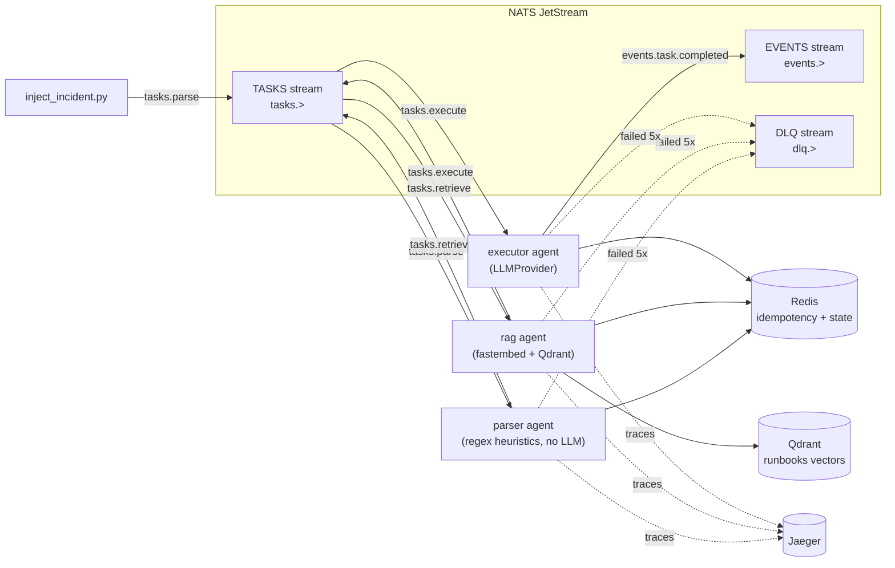
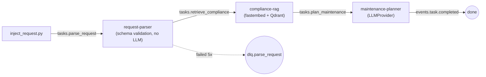

# AgentMesh

Infrastructure platform for building distributed multi-agent systems of
arbitrary configuration. Agents are plain async Python classes, wired
together purely through NATS JetStream subjects and a YAML config — there is
no central orchestrator and no agent framework underneath.

A working example ships with the platform: a 3-agent PostgreSQL incident
triage pipeline (`parser` → `rag` → `executor`), plus a 4-agent variant
(`+ summarizer`) that proves you can reshape the pipeline by editing YAML
alone.

## Architecture



Principles:

- **No central orchestrator.** Every agent is an independent process that
  subscribes to one subject and publishes to others. Topology lives entirely
  in a system YAML config, not in code.
- **Core = SDK, not a router.** `platform_core` gives every agent connection
  handling, tracing, logging, idempotency, retries, and graceful shutdown.
  It never sees or interprets agent payloads.
- **Adding an agent never touches the core.** New module + a few lines of
  YAML + one compose service. See [Adding your own agent](#adding-your-own-agent).
- **Fault tolerance lives in the bus and the SDK**, not in individual agent
  code — durable consumers, ack/nak, `max_deliver` → DLQ, exponential
  backoff, and Redis-backed idempotency are all handled by `BaseAgent`.

## Quickstart

```bash
make build   # docker compose build — the only step that touches the network
make demo    # docker compose up -d, then inject one incident, purely local from here
```

Then open **http://localhost:16686** (Jaeger) and look for the `parser`
service's traces — a single trace should span `parser → rag → executor`.

`make build` builds the generic agent image once — baking in the
`fastembed` embedding model so no agent needs network at runtime to fetch
it — and reuses it for `parser`, `rag`, and `executor`, which differ only
by the `AGENT_NAME` env var.

`build` and `demo` are deliberately separate targets: `docker compose up
--build` re-checks image registries for base-image metadata even when
everything is already cached locally, so it fails on a flaky or offline
network despite the runtime itself needing no network at all once built.
Run `make build` once (or after you change code), then `make
demo`/`make demo-alt`/`make chaos` as many times as you like without
touching the network again.

Other entry points:

```bash
make build       # (re)build the agent image after a code change
make up          # just bring up the whole stack, no rebuild
make demo-alt    # runs the 4-agent config (parser/rag/executor/summarizer)
make chaos       # kills executor mid-task, shows it recovers on its own
make test        # unit tests (no Docker required)
make logs        # tail all service logs
make down        # tear everything down
```

## Adding your own agent

Say you want a `notifier` agent that posts a message whenever an incident is
resolved. Three steps, none of them touching `platform_core` or any existing
agent:

**1. Write the handler** — `agents/notifier.py`:

```python
from __future__ import annotations

from typing import Any

from pydantic import BaseModel

from platform_core.agent import BaseAgent
from platform_core.envelope import Envelope
from platform_core.observability import get_logger


class TaskCompletedPayload(BaseModel):
    incident: dict[str, Any]
    plan: dict[str, Any]


class NotifierAgent(BaseAgent):
    async def handle(self, env: Envelope) -> None:
        data = TaskCompletedPayload.model_validate(env.payload)
        log = get_logger(agent=self.config.name, correlation_id=env.correlation_id)
        log.info(
            "would_notify",
            host=data.incident.get("host"),
            action=data.plan.get("action"),
        )
        # send a Slack message, page someone, whatever — this is regular
        # agent code, it just can't call other agents directly.
```

Note what's missing: no NATS client setup, no ack/nak, no retry logic, no
tracing boilerplate, no idempotency check. `BaseAgent` handles all of it —
you only implement `handle()`, and raise if something goes wrong (the SDK
naks and eventually dead-letters for you).

**2. Register it in a system YAML** (e.g. add to
`configs/incident_triage.yaml`, or a copy of it):

```yaml
  - name: notifier
    module: agents.notifier:NotifierAgent
    subscribes: events.task.completed
    publishes: []
    stores: []
```

`module` is `<python.module.path>:<ClassName>`, imported by the universal
runner at startup. `subscribes` is the one subject this agent's durable
consumer listens on. `publishes` is informational/self-documenting — your
handler can call `self.publish(subject, ...)` for any subject, but listing
the ones you use here keeps the topology readable from the YAML alone.

**3. Add a compose service** in `docker-compose.yml`, copy-pasting the
`executor` block and changing the name and `AGENT_NAME`:

```yaml
  notifier:
    <<: *agent-common
    environment:
      <<: *agent-env
      AGENT_NAME: notifier
    depends_on:
      nats: { condition: service_healthy }
      redis: { condition: service_healthy }
      qdrant: { condition: service_healthy }
      jaeger: { condition: service_healthy }
```

That's the whole recipe. `configs/triage_with_summary.yaml` is a worked
example of the same pattern — it adds a `summarizer` agent and reroutes
`executor`'s `publishes` from `events.task.completed` to `tasks.summarize`,
entirely in YAML. Run `make demo-alt` to see it: same `parser`, `rag`, and
`executor` containers and code, different pipeline shape.

## The Envelope protocol

Every message on the bus is a JSON-encoded `Envelope`
(`platform_core/envelope.py`):

| Field | Meaning |
|---|---|
| `spec_version` | Envelope schema version, currently `"1.0"`. |
| `message_id` | UUID4, unique per message. Used as the idempotency key. |
| `correlation_id` | UUID4, created once when a task enters the system and copied unchanged onto every message derived from it — the thread that ties a whole incident's messages together. |
| `traceparent` | W3C trace context, injected via `opentelemetry.propagate.inject` on publish and extracted on receive, so every agent's span joins the same distributed trace. |
| `sender` | Name of the publishing agent. |
| `subject` | The NATS subject this message was published on. |
| `type` | `task` \| `result` \| `event` \| `error`. |
| `reply_to` | Optional reply subject (unused by the reference pipeline, available for request/reply patterns). |
| `created_at` | UTC timestamp. |
| `ttl_ms` | Handler timeout in milliseconds (default 60000) — `asyncio.wait_for(handle(...), timeout=ttl_ms/1000)`. |
| `payload` | Arbitrary JSON. The core never interprets it — each receiving agent validates it with its **own** pydantic model. |

Subject naming: task subjects are `tasks.<role>` (e.g. `tasks.parse`),
platform events are `events.heartbeat` / `events.agent.started` /
`events.agent.stopped` / `events.task.completed` / `events.task.failed`,
and dead letters are `dlq.<role>`.

## Fault tolerance

What's guaranteed, and how:

- **One agent crashing doesn't stop the system.** Each agent is an
  independent container with `restart: unless-stopped`. The bus (JetStream)
  holds messages durably, so a dead agent just stops consuming — it doesn't
  drop anything in flight, and other agents are unaffected.
- **At-least-once delivery, exactly-once processing.** Every agent has a
  durable JetStream consumer (`max_deliver=5`, `ack_wait=30s`). If a handler
  raises, the SDK `nak`s the message with exponential backoff
  (`min(2**attempt, 30)` seconds) so JetStream redelivers it. Before running
  `handle()`, the SDK does `SETNX processed:{message_id}` in Redis
  (TTL 1h) — a redelivered message that already succeeded is ack'd
  immediately without being handled twice.
- **Poison messages don't loop forever.** After the 5th failed delivery, the
  SDK publishes the message to `dlq.<role>` (with an `error` field added to
  the payload) and `term()`s it so JetStream stops retrying. Covered by
  `tests/test_e2e.py::test_unprocessable_message_is_dead_lettered_after_max_deliver`.
  Run `make chaos` to see the restart + redelivery path live: it injects an
  incident, kills `executor` mid-task, and shows the container restart,
  JetStream redeliver the unacked message, and the task still complete.
- **Liveness is externally observable.** Every agent touches `/tmp/healthy`
  once per 10s heartbeat loop; the compose healthcheck checks that file's
  mtime is under 30s old. A hung agent (heartbeat loop stalled) goes
  unhealthy and gets restarted by Docker.
- **Shutdown is graceful.** On `SIGTERM`/`SIGINT`, an agent stops pulling new
  messages, lets whatever it's currently processing finish, publishes
  `events.agent.stopped`, and drains its NATS connection before exiting.

## Observability

All traces go to Jaeger via OTLP; all logs are structured JSON on stdout
(`docker compose logs <service>` / `make logs`), carrying `agent`,
`message_id`, `correlation_id`, and `trace_id` on every line so you can grep
one incident's logs across all three agents by `correlation_id`.

To inspect a trace:

1. Run `make demo` (or `make chaos` / `make demo-alt`).
2. Open **http://localhost:16686**.
3. In the **Service** dropdown, pick `parser` (or `inject_incident` to see
   the whole thing from the very first hop).
4. Click **Find Traces**. You should see one trace per injected incident.
5. Open it — it should show nested spans: `inject_incident` →
   `agent.parser.handle` → `agent.rag.handle` → `agent.executor.handle` (or
   `+ agent.summarizer.handle` in the alt config), because `traceparent` is
   propagated through the `Envelope` on every publish.
6. Each span carries `message_id` and `correlation_id` tags, matching what
   you'll see in the JSON logs for the same request.

## Switching the LLM provider

Default is `mock` — a deterministic, network-free provider
(`platform_core/llm.py::MockProvider`) that reads the incident's own
`error_class` out of the prompt and returns the matching canned PostgreSQL
remediation plan. This is what `make demo` uses, and it needs no API key.

To use DeepSeek instead:

```bash
export LLM_PROVIDER=deepseek
export DEEPSEEK_API_KEY=sk-...
make up
```

`LLM_PROVIDER` and `DEEPSEEK_API_KEY` are read from the environment and
substituted into `llm.provider` in the system YAML
(`provider: ${LLM_PROVIDER:-mock}`) — the config file itself never contains
a secret. `build_llm_provider()` picks the implementation at agent startup
based on that value; no code changes needed either way.

## Second domain: maintenance requests

A second, unrelated pipeline — DBMS cluster maintenance requests — proves
the platform's central claim: a new domain plugs in as new files, with
**zero changes to the core or to any existing agent**.

### The request

Input is a JSON maintenance request (`agents/maintenance/schemas.py`'s
`MaintenanceRequest`, whitelist-validated — `extra: forbid`, every field
constrained, `Literal` enums, subtask order required to be unique):

```json
{
  "request_id": "REQ-2024-0117",
  "priority": "critical",
  "object": "cluster-123",
  "object_type": "patroni_cluster",
  "purpose": "risk_mitigation",
  "subtasks": [
    {"order": 1, "action": "update_os", "constraints": "rolling, node-by-node"},
    {"order": 2, "action": "renew_certificates", "constraints": null},
    {"order": 3, "action": "run_compliance_check", "constraints": "CIS baseline"}
  ],
  "sla_minutes": 30,
  "is_downtime": false
}
```

### The pipeline



`request-parser` validates and normalizes (no LLM — same principle as the
first domain's `parser`: an agent doesn't have to be an LLM agent).
`compliance-rag` embeds the request and retrieves from its own Qdrant
collection, `compliance_scenarios`, seeded from `data/compliance/*.md` —
kept entirely separate from the first domain's `runbooks` collection.
`maintenance-planner` builds a plan, one entry per subtask.

### Trust nothing — input or LLM output

Same principle applied on both ends of the pipeline:

- **Input**: `request-parser` validates against `MaintenanceRequest`'s
  whitelist schema. A `ValidationError` is logged with the full field-level
  error list (`request_validation_failed`) and then **re-raised, not
  swallowed** — the platform's existing nak → redeliver → `max_deliver` →
  DLQ mechanism handles it from there. No new fault-tolerance code needed.
- **LLM output**: `maintenance-planner` validates the model's JSON response
  against `MaintenancePlan` the same way — a malformed response is a
  `ValidationError` too, and gets the same DLQ treatment. Once it *is*
  structurally valid, its `sla_verdict` field still isn't trusted:
  `apply_sla_override()` recomputes `exceeds` deterministically from
  `total_estimated_minutes` vs. `sla_minutes` whenever the model's own
  estimate blows the budget, regardless of what the model claimed.

Run `make demo-request-invalid` to see the whole loop live: an
`object_type` outside the whitelist gets nak'd 5 times with backoff and
lands on `dlq.parse_request`, verified by `scripts/show_dlq.py` (a real
pass/fail check on the specific injected request, not a log-tail-and-hope).

### Running it

```bash
make build
docker compose --profile maintenance up -d   # also brings up the default profile (parser/rag/executor) — harmless, they just sit idle
make demo-request            # valid request -> a 3-subtask plan, sla_verdict=fits
make demo-request-invalid    # invalid request -> dlq.parse_request after max_deliver
uv run pytest -m e2e tests/test_e2e_maintenance.py
```

### Proof: zero core changes

The whole domain is 16 new files. Exactly two existing files were touched,
both explicitly permitted for additive changes only — `docker-compose.yml`
gained a new `maintenance` profile (services `seed-compliance`,
`request-parser`, `compliance-rag`, `maintenance-planner`; every diff line
is an addition, none of the existing services changed) and `Makefile`
gained two new targets plus its own name in the `.PHONY` line. Everything
under `platform_core/`, and every one of the four first-domain agents, is
byte-for-byte unchanged since the platform was frozen:

```bash
git diff --stat 9a54f88 HEAD -- platform_core agents/parser.py agents/rag.py agents/executor.py agents/summarizer.py
# (empty output)
```

(`9a54f88` is the commit the platform was frozen at — `fix(makefile): split
build out of demo/demo-alt/chaos, drop --build there`, the last commit
before this domain's work started.)

## Repository layout

```
platform_core/       SDK: envelope, bus, agent lifecycle, config, observability, llm, stores
agents/               parser, rag, executor, summarizer (PoC agents; add your own here)
agents/maintenance/   second domain: request_parser, compliance_rag, maintenance_planner, schemas, mock_plans
configs/              system YAMLs — topology lives here, not in code
scripts/              seed_runbooks.py, inject_incident.py, chaos.sh, seed_compliance.py, inject_request.py, show_dlq.py
data/runbooks/        PostgreSQL runbooks seeded into Qdrant for the rag agent
data/compliance/      maintenance compliance docs seeded into their own Qdrant collection
tests/                unit tests + e2e (needs `make build && make up`)
docs/adr.md           architecture decision records
```

## Running the test suite

```bash
make test                                       # unit tests, no infra required
make build && make up && uv run pytest -m e2e   # full pipeline + DLQ test against live compose (both domains)
```
