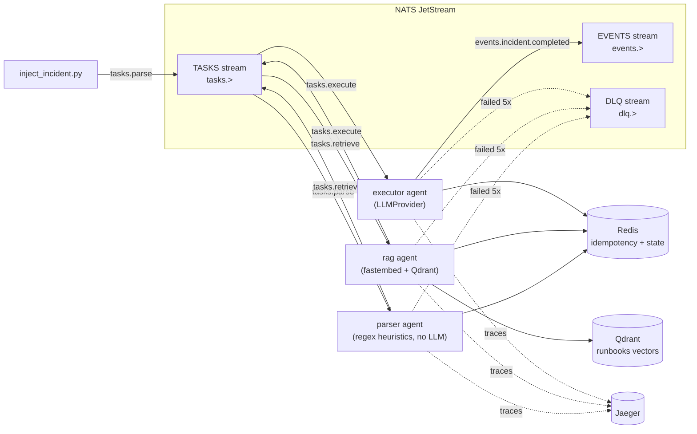
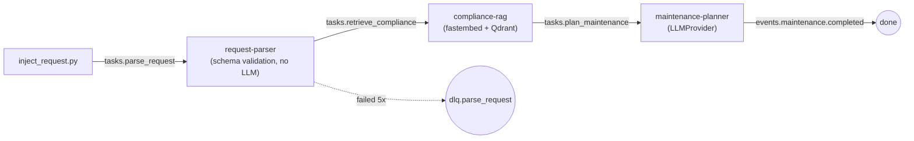

# AgentMesh

Infrastructure platform for building distributed multi-agent systems of
arbitrary configuration. Agents are plain async Python classes that communicate
only through NATS JetStream. Their logical routing and runtime parameters live
in YAML; deployment membership stays explicit in Docker Compose so every agent
is visibly isolated as its own service. There is no central orchestrator and no
agent framework underneath.

A working example ships with the platform: a 3-agent PostgreSQL incident
triage pipeline (`parser` → `rag` → `executor`), plus a 4-agent variant
(`+ summarizer`) that proves the same agent code can be rerouted by selecting a
different YAML topology.

## Architecture



Principles:

- **No central orchestrator.** Every agent is an independent process that
  subscribes to one subject and publishes to others. The logical message graph
  lives in a system YAML config; Compose declares which isolated services are
  deployed.
- **Core = SDK, not a router.** `platform_core` gives every agent connection
  handling, tracing, logging, idempotency, retries, and graceful shutdown.
  It never sees or interprets agent payloads.
- **Adding an agent never touches the core.** New module + a few lines of
  YAML + one compose service. See [Adding your own agent](#adding-your-own-agent).
- **Fault tolerance lives in the bus and the SDK**, not in individual agent
  code — durable consumers, ack/nak, an application retry budget → DLQ,
  exponential backoff, and Redis-backed idempotency are all handled by
  `BaseAgent`.

## Requirements coverage

| Brief requirement | Implementation |
|---|---|
| One agent protocol | Versioned Pydantic `Envelope` on every NATS subject. |
| Independent runtimes | One process and one Compose service per agent, all using a generic image. |
| Add an agent without changing the core | Dynamic `<module>:<Class>` loading from YAML through the universal runner. |
| End-to-end observability | W3C trace propagation to Jaeger plus structured correlated logs; failed attempts are marked as error spans. |
| Shared stores on demand | Redis is the platform idempotency store; Qdrant is attached only to agents that declare it. |
| Agent-agnostic fault tolerance | Durable consumers, ack progress, retry/backoff, bounded DLQ, health supervision and restart policies live in the SDK/infra. |
| One-command containerized demo | `make first-run`, with an exact terminal-event assertion rather than a fixed sleep. |
| YAML/env acceptance criterion | Agent modules, exact subjects, shared-store selection, parameters and LLM selection live in validated YAML/env configuration, not core source edits. |

## Quickstart

Prerequisites: Docker Engine or Docker Desktop with Compose v2, `make`, free
localhost ports `4222`, `8222`, `6333`, `6379`, `4317`, `4318`, and `16686`,
and outbound network access for the first image/model build. The default demo
needs neither host Python nor an API key.

```bash
make first-run   # build, start the stack, wait for health, and inject one incident
```

The command exits non-zero unless the exact injected correlation ID reaches
`events.incident.completed` from `executor`.

Then open **http://localhost:16686** (Jaeger) and look for the `parser`
service's traces — a single trace should span `parser → rag → executor`.

`make first-run` is the one-command path for a clean checkout. It runs
`make build` and then `make demo`. The build creates the generic agent image
once — baking in the
`fastembed` embedding model so no agent needs network at runtime to fetch
it — and reuses it for `parser`, `rag`, and `executor`, which differ only
by the `AGENT_NAME` env var.

`build` and `demo` are deliberately separate targets: `docker compose up
--build` re-checks image registries for base-image metadata even when
everything is already cached locally, so it fails on a flaky or offline
network despite the runtime itself needing no network at all once built.
After one successful `make first-run`, all runtime images and the embedding
model are local; `make demo`/`make demo-alt`/`make chaos` can then be rerun
without network access. Use `make build` after changing application code.

Optional live-provider settings are documented in `.env.example`; the
deterministic `mock` provider remains the safe default.

Other entry points:

```bash
make first-run   # clean-checkout path: build + demo in one command
make build       # (re)build the agent image after a code change
make up          # just bring up the whole stack, no rebuild
make demo        # rerun the default demo from an already-built image
make demo-alt    # runs the 4-agent config (parser/rag/executor/summarizer)
make chaos       # deterministically kills executor inside handle(), verifies redelivery
make test        # unit tests (no Docker required)
make logs        # tail all service logs
make down        # tear everything down
```

## Adding your own agent

Say you want a `notifier` agent that posts a message whenever an incident is
resolved. Three steps, none of them touching `platform_core` or any existing
agent:

**1. Write the handler** — `agents/notifier.py`:

```python
from __future__ import annotations

from typing import Any

from pydantic import BaseModel

from platform_core.agent import BaseAgent
from platform_core.envelope import Envelope
from platform_core.observability import get_logger


class TaskCompletedPayload(BaseModel):
    incident: dict[str, Any]
    plan: dict[str, Any]


class NotifierAgent(BaseAgent):
    async def handle(self, env: Envelope) -> None:
        data = TaskCompletedPayload.model_validate(env.payload)
        log = get_logger(agent=self.config.name, correlation_id=env.correlation_id)
        log.info(
            "would_notify",
            host=data.incident.get("host"),
            action=data.plan.get("action"),
        )
        # send a Slack message, page someone, whatever — this is regular
        # agent code, it just can't call other agents directly.
```

Note what's missing: no NATS client setup, no ack/nak, no retry logic, no
tracing boilerplate, no idempotency check. `BaseAgent` handles all of it —
you only implement `handle()`, and raise if something goes wrong (the SDK
naks and eventually dead-letters for you).

**2. Register it in a system YAML** (e.g. add to
`configs/incident_triage.yaml`, or a copy of it):

```yaml
  - name: notifier
    module: agents.notifier:NotifierAgent
    subscribes: events.incident.completed
    publishes: []
    stores: []
```

`module` is `<python.module.path>:<ClassName>`, imported by the universal
runner at startup. `subscribes` is the one exact subject this agent's durable
consumer listens on. Durable names and idempotency keys are scoped by
`agent + subscribed subject`, so two different event consumers may legitimately
process the same `message_id`, while switching between compatible YAML variants
reuses the existing task consumer. Agent names must be unique inside one system
config.

`publishes` declares downstream subjects; the shipped agents read it at
runtime to choose their destination, which is how the summary variant reroutes
`executor` without a code change. `BaseAgent` does not enforce it as an
allowlist, so a custom handler may publish to several declared subjects or to a
subject computed at runtime. Task fan-out should use distinct `tasks.*`
subjects; `events.*` supports independent fan-out consumers.

`stores: [qdrant]` opts an agent into the shared vector store. Redis is a
platform-internal dependency for retry idempotency and is available to every
agent regardless of `stores`.

**3. Add a compose service** in `docker-compose.yml`, copy-pasting the
`executor` block and changing the name and `AGENT_NAME`:

```yaml
  notifier:
    <<: *agent-common
    environment:
      <<: *agent-env
      AGENT_NAME: notifier
    depends_on:
      nats: { condition: service_healthy }
      redis: { condition: service_healthy }
```

That's the whole recipe. `configs/triage_with_summary.yaml` is a worked
example of the same pattern — it adds a `summarizer` agent and reroutes
`executor`'s `publishes` from `events.incident.completed` to `tasks.summarize`,
entirely in YAML. Run `make demo-alt` to see it: same `parser`, `rag`, and
`executor` containers and code, different pipeline shape.

Configuration models reject unknown fields, duplicate agent names, empty
identifiers, unknown shared stores, wildcard/custom subjects and unknown LLM
providers at startup. The base schema validates platform-level structure;
agent-specific parameter semantics are owned and validated by each agent
implementation. If an existing durable consumer is accidentally reused with
another subject, startup fails explicitly instead of silently binding new code
to the old filter. Existing compatible consumers have their `ack_wait` and
server delivery policy reconciled on startup rather than silently retaining
stale values.

## The Envelope protocol

Every message on the bus is a JSON-encoded `Envelope`
(`platform_core/envelope.py`):

| Field | Meaning |
|---|---|
| `spec_version` | Envelope schema version, currently `"1.0"`; unsupported versions are rejected. |
| `message_id` | UUID4 generated per message. Combined with the durable consumer identity for idempotency. |
| `correlation_id` | Opaque workflow ID (the included injectors use UUID4), copied unchanged onto every derived message. |
| `traceparent` | W3C trace context, injected via `opentelemetry.propagate.inject` on publish and extracted on receive, so every agent's span joins the same distributed trace. |
| `sender` | Name of the publishing agent. |
| `subject` | The NATS subject this message was published on. |
| `type` | `task` \| `event` \| `error`; the subject contract uses `task` for `tasks.*`, `event` for `events.*`, and `error` for `dlq.*`. |
| `reply_to` | Optional reply subject (unused by the reference pipeline, available for request/reply patterns). |
| `created_at` | UTC timestamp. |
| `ttl_ms` | Handler timeout in milliseconds, default 60000 and capped at 15 minutes. The SDK refreshes the JetStream ack lease while work is active. |
| `payload` | Arbitrary JSON object. The core never interprets it — each receiving agent validates it with its **own** Pydantic model. |

Subject naming: task subjects are `tasks.<role>` (e.g. `tasks.parse`),
platform events are `events.heartbeat` / `events.agent.started` /
`events.agent.stopped`; domain events in the examples are
`events.incident.completed` and `events.maintenance.completed`; dead letters are
`dlq.<role>`. Configured subjects must be exact (no `*`/`>` wildcards), and
publish/receive paths reject an Envelope whose `subject` or `type` disagrees
with the NATS delivery subject.

## Fault tolerance

What's guaranteed, and how:

- **One agent crashing doesn't stop the system.** Each agent is an
  independent container with `restart: unless-stopped`. The bus (JetStream)
  holds messages durably, so a dead agent just stops consuming — it doesn't
  drop anything in flight, and other agents are unaffected.
- **At-least-once delivery with best-effort duplicate suppression.** Every
  agent has an agent-and-subject-scoped durable JetStream consumer
  (`max_deliver=-1` at the server, `ack_wait=30s`). The SDK owns a five-attempt
  application retry budget. It sends `in_progress` every 10 seconds from the
  first Redis check through handler execution, marker storage and final
  settlement, so slow valid work is not concurrently redelivered merely
  because it exceeds `ack_wait`. If the handler raises, the SDK `nak`s with
  exponential backoff (`min(2**attempt, 30)` seconds). Before `handle()`, it checks
  `processed:{agent-subscription-consumer}:{message_id}` in Redis; only after the
  handler and downstream publish succeed does it store the one-hour marker and
  ack. If that final ack is lost, the marker makes redelivery skip the handler
  and retry only the ack. The consumer scope prevents one event listener from
  suppressing another. This is deliberately not advertised as exactly-once;
  the remaining duplicate window is documented below.
- **Poison messages don't loop forever.** After the 5th failed delivery, the
  SDK publishes the message to `dlq.<role>` and `term()`s it so JetStream
  stops retrying. Small payloads are preserved with an `error` field; large
  payloads and exception text are bounded so the DLQ record itself cannot
  exceed the broker's payload limit. Covered by
  `tests/test_e2e.py::test_unprocessable_message_is_dead_lettered_after_max_deliver`.
  Protocol-invalid Envelopes follow the same retry budget and then land in
  the DLQ with a bounded raw-message excerpt. Server delivery remains unlimited
  until this handoff succeeds: if publishing the DLQ record fails, the SDK
  explicitly schedules another delivery instead of stranding the message.
  An agent consuming a `dlq.*` subject terminates a repeatedly failing dead
  letter without recursively publishing it back into the same DLQ.
- **Background failures cannot leave a healthy zombie.** The service supervises
  both its consumer and bus-heartbeat tasks. Five consecutive unexpected fetch
  or heartbeat-publish failures stop the process, allowing the container
  restart policy to recover it; transient failures are retried with backoff.
  Run `make chaos` to see the restart + redelivery path live: a dedicated
  config adds a controlled processing window, the script waits until
  `executor` is inside `handle()`, kills it, verifies Docker's `RestartCount`
  increased, and requires `num_delivered >= 2` on the successful result.
- **Liveness is externally observable.** An agent updates `/tmp/healthy` only
  after successfully publishing its 10-second bus heartbeat. The Compose
  healthcheck requires that marker to be under 30 seconds old. A stalled event
  loop or disconnected bus therefore becomes `unhealthy`; repeated bus
  failures also terminate PID 1 and activate `restart: unless-stopped`.
- **Shutdown is graceful.** On `SIGTERM`/`SIGINT`, an agent stops pulling new
  messages, lets whatever it's currently processing finish, publishes
  `events.agent.stopped`, closes agent-specific/Redis/Qdrant clients, and
  drains its NATS connection before exiting. Compose grants 16 minutes before
  `SIGKILL`, covering the protocol's 15-minute maximum handler TTL plus cleanup.

Known PoC limits:

- Delivery is at least once. If a process dies after publishing its result
  but before storing the processed marker, it can publish that result again.
  The included executor accepts only `dry_run: true` and fails closed at
  startup for `false`, so the demo has no destructive external side effect; a
  real executor must use a domain idempotency key or a transactional outbox
  appropriate to its target system.
- Compose runs one NATS node and one Redis node without persistent volumes.
  This proves recovery from an **agent** failure, not infrastructure high
  availability. Production would use clustered/persistent deployments.
- The PoC does not configure inter-service authentication or TLS.
- The TASKS stream intentionally uses work-queue retention: one task subject
  represents one competing-consumer role. Branching is expressed with distinct
  task subjects; broadcast observers consume `events.*`.
- Durable consumer and Redis identities are scoped by `agent + subject`, not
  by the display-level `system` name. Separate deployments sharing one NATS
  account/Redis database must therefore use isolated infrastructure or add an
  external namespace; this Compose PoC intentionally represents one platform
  deployment.
- The offline incident mock is deterministic but not a general reasoner: it
  returns a canned plan only when the parsed `error_class` and a retrieved
  runbook `Source` match. The maintenance mock is similarly a fixed fixture
  for the four shipped `purpose` scenarios; arbitrary valid combinations
  require the live provider or additional fixtures.
- The maintenance planner deterministically verifies action/order mapping,
  totals and SLA rules (including the critical hard ceiling and a required
  delay note for high-priority overruns). Its free-text steps, interpretation
  of textual constraints, qualitative risk and real-world downtime feasibility
  remain model proposals because the PoC has no live health/window/sign-off
  inputs. The demo never executes them against a database.

## Observability

All traces go via OTLP to the pinned Jaeger v2.20 all-in-one image; all logs
are structured JSON on stdout (`docker compose logs <service>` / `make logs`).
Message-processing logs
carry `agent`, `message_id`, `correlation_id`, and `trace_id`; lifecycle logs
that do not belong to a message carry the agent name. This lets you grep one
incident's logs across all agents by `correlation_id`. Handler failures are
recorded as span exception events with `ERROR` status, so retries are visible
as failures in Jaeger rather than green spans with only an error log.

Jaeger is deliberately not a startup dependency: if the collector is
temporarily absent, export failures do not stop message processing. The stored
`EVENTS` stream is bounded to seven days/256 MiB and the DLQ to 30 days/512 MiB,
preventing periodic heartbeat events from growing JetStream without limit.

To inspect a trace:

1. Run `make demo` (or `make chaos` / `make demo-alt`).
2. Open **http://localhost:16686**.
3. In the **Service** dropdown, pick `parser` (or `inject_incident` to see
   the whole thing from the very first hop).
4. Click **Find Traces**. You should see one trace per injected incident.
5. Open it — it should show nested spans: `inject_incident` →
   `agent.parser.handle` → `agent.rag.handle` → `agent.executor.handle` (or
   `+ agent.summarizer.handle` in the alt config), because `traceparent` is
   propagated through the `Envelope` on every publish.
6. Each span carries `message_id` and `correlation_id` tags, matching what
   you'll see in the JSON logs for the same request.

## Switching the LLM provider

Default is `mock` — a deterministic, network-free provider
(`platform_core/llm.py::MockProvider`) that reads the incident's own
`error_class` out of the prompt and returns the matching canned PostgreSQL
plan only if RAG also supplied the corresponding runbook source; otherwise it
fails safe to `manual_triage`. This makes retrieval affect the offline result
while keeping `make demo` reproducible and API-key-free.

To use DeepSeek instead:

```bash
export LLM_PROVIDER=deepseek
export DEEPSEEK_API_KEY=sk-...
make up
```

`LLM_PROVIDER` and `DEEPSEEK_API_KEY` are read from the environment and
substituted into `llm.provider` in the system YAML
(`provider: ${LLM_PROVIDER:-mock}`) — the config file itself never contains
a secret. `build_llm_provider()` picks the implementation at agent startup
based on that value; no code changes needed either way.

## Second domain: maintenance requests

A second, unrelated pipeline — DBMS cluster maintenance requests — proves
the platform's central claim: a new domain plugs in as new files, with
**zero changes to the core or to any existing agent**.

### The request

Input is a JSON maintenance request (`agents/maintenance/schemas.py`'s
`MaintenanceRequest`, schema-typed and whitelist-validated — `extra: forbid`,
bounded fields/lists, `Literal` enums, and subtask order required to be the
contiguous ascending sequence `1..N`):

```json
{
  "request_id": "REQ-2024-0117",
  "priority": "critical",
  "object": "cluster-123",
  "object_type": "patroni_cluster",
  "purpose": "risk_mitigation",
  "subtasks": [
    {"order": 1, "action": "update_os", "constraints": "rolling, node-by-node"},
    {"order": 2, "action": "renew_certificates", "constraints": null},
    {"order": 3, "action": "run_compliance_check", "constraints": "CIS baseline"}
  ],
  "sla_minutes": 30,
  "is_downtime": false
}
```

### The pipeline



`request-parser` validates and normalizes (no LLM — same principle as the
first domain's `parser`: an agent doesn't have to be an LLM agent).
`compliance-rag` embeds the request and retrieves from its own Qdrant
collection, `compliance_scenarios`, seeded from `data/compliance/*.md` —
kept entirely separate from the first domain's `runbooks` collection.
`maintenance-planner` builds a plan and then requires an exact one-to-one match
with the requested subtask count, order and action.

### Trust nothing — input or LLM output

Same principle applied on both ends of the pipeline:

- **Input**: `request-parser` validates against `MaintenanceRequest`'s
  whitelist schema. A `ValidationError` is logged with the full field-level
  error list (`request_validation_failed`) and then **re-raised, not
  swallowed** — the platform's existing nak → redeliver → five-attempt
  application budget → DLQ mechanism handles it from there. No new
  fault-tolerance code needed.
- **LLM output**: `maintenance-planner` validates the model's JSON response
  against `MaintenancePlan` the same way — a malformed response is a
  `ValidationError` too, and gets the same DLQ treatment. Structural validity
  is not enough: `validate_and_finalize_plan()` rejects missing, extra,
  reordered or substituted actions, recomputes the total from the entry
  estimates, and derives the verdict deterministically (`<80%` = `fits`,
  `80–100%` = `at_risk`, over budget = `exceeds`). A critical request over its
  hard SLA ceiling fails closed for re-scoping instead of publishing an unsafe
  plan; a high-priority overrun requires a non-empty delay explanation.

Run `make demo-request-invalid` to see the whole loop live: an
`object_type` outside the whitelist gets nak'd 5 times with backoff and
lands on `dlq.parse_request`, verified by `scripts/show_dlq.py` (a real
pass/fail check on the specific injected request, not a log-tail-and-hope).

### Running it

```bash
make build
docker compose --profile maintenance up -d   # also brings up the default profile (parser/rag/executor) — harmless, they just sit idle
make demo-request            # valid request -> validated 3-subtask plan, 25/30 min = at_risk
make demo-request-invalid    # invalid request -> dlq.parse_request after five deliveries
uv run pytest -m e2e tests/test_e2e_maintenance.py
```

### Proof: the second domain required zero core changes

The maintenance domain was added between the platform-freeze commit
`9a54f88` and the completed-domain commit `5c71265`. Its change set added
domain files plus additive Compose/Make targets; it did not modify
`platform_core/` or any first-domain agent:

```bash
git diff --stat 9a54f88 5c71265 -- platform_core agents/parser.py agents/rag.py agents/executor.py agents/summarizer.py
# (empty output)
```

Later generic reliability improvements may change the core, but they are
independent of that historical domain-addition diff.

## Repository layout

```
platform_core/       SDK: envelope, bus, agent lifecycle, config, observability, llm, stores
agents/               parser, rag, executor, summarizer (PoC agents; add your own here)
agents/maintenance/   second domain: request_parser, compliance_rag, maintenance_planner, schemas, mock_plans
configs/              system YAMLs — logical routing and agent parameters
scripts/              seed/inject/wait helpers plus the deterministic chaos check
data/runbooks/        PostgreSQL runbooks seeded into Qdrant for the rag agent
data/compliance/      maintenance compliance docs seeded into their own Qdrant collection
tests/                unit tests + e2e (needs the Compose stack; maintenance tests need its profile)
docs/adr.md           architecture decision records
.github/workflows/    locked unit/lint/config CI
.env.example          optional live-LLM environment settings
```

## Running the test suite

```bash
make test                                       # unit tests, no infra required
make build
docker compose --profile maintenance up -d
uv run pytest -m e2e                            # full pipeline + DLQ tests for both domains
```

GitHub Actions runs the locked unit suite, Ruff lint/format checks and the
default, build, summary and maintenance Compose renders on every push and pull
request. Runtime e2e/chaos checks remain explicit because they build the
embedding image and exercise process termination.
